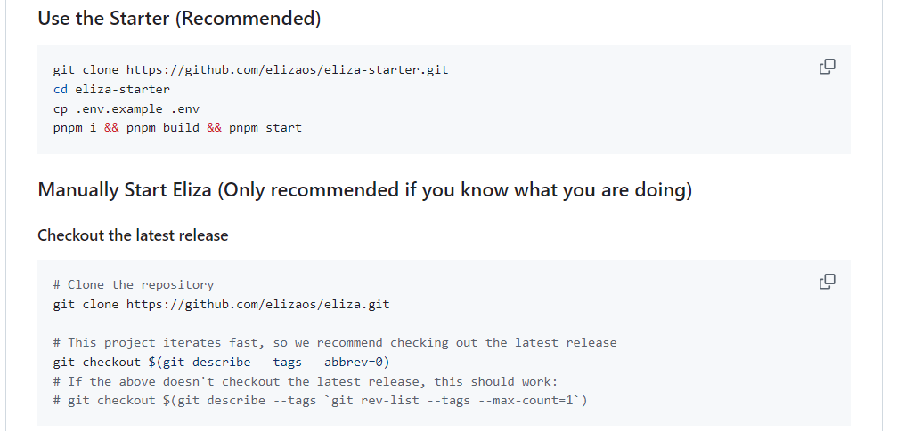

# eliza官方启动文档
1. https://github.com/elizaOS/eliza
2. 
# 依赖安装及编译报错
## 需要配置代理或者外网
## linxu-fedora
1. 安装开发工具：
sudo dnf groupinstall "Development Tools"
sudo dnf install make gcc-c++ nodejs-devel openssl-devel libtool git opus-devel
gcc -version # 查看gcc版本
sudo dnf install gcc-toolset-11  # gcc更高版本
scl enable gcc-toolset-11 bash  # 启用工具集：
1. 安装Opus开发库
sudo dnf install opus-devel
安装node构建工具：
npm install -g node-gyp
npm install -g node-pre-gyp
安装python3.12  python3.11

## linux-ubuntu
1. 安装开发工具：
sudo apt-get update
sudo apt-get install -y build-essential python3
2. 安装Opus开发库
sudo apt-get install libopus-dev

## 清除缓存重新执行
rm -rf node_modules
pnpm store prune
pnpm install

## 当内存不够用时：
sudo fallocate -l 4G /swapfile1  # 创建一个4GB大小的交换文件
sudo chmod 600 /swapfile        # 设置正确的权限
sudo mkswap /swapfile           # 设置交换区域
sudo swapon /swapfile           # 启用交换文件
echo '/swapfile none swap sw 0 0' | sudo tee -a /etc/fstab  # 确保重启后仍然有效

export PNPM_CONCURRENCY=4  # 可以通过设置环境变量 PNPM_CONCURRENCY 来控制并发任务数
